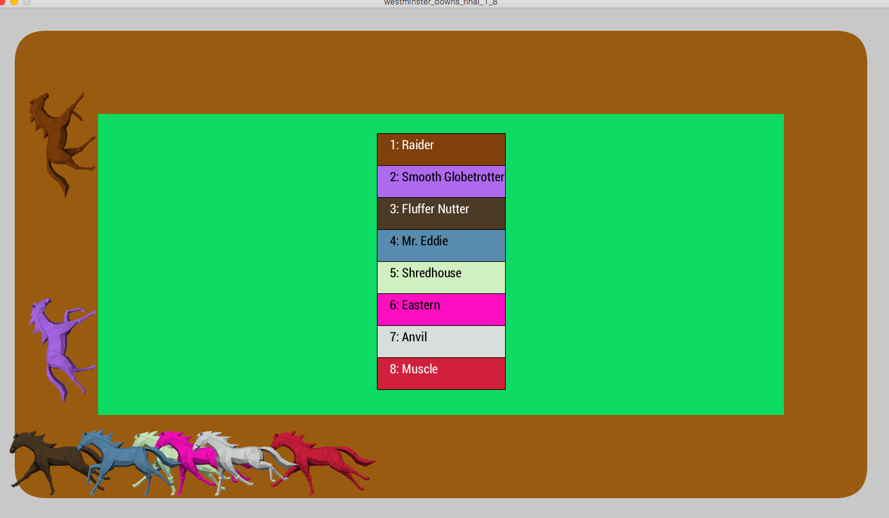

# Westminster-Downs
A virtual horse racing game. It shows the fictional race track "Westminster Downs" where 8 horses race against each other to be the first horse to 4 laps. This is my second version of the game because I wanted to have better visuals such as animating horses and a larger racetrack. My goal was to create a unique set of horses, each with its own probability of winning the race. Additonally, the program dictates that if the horse likely to win first place fails to place first, it will be then be the horse most likely to place second.   The races are completely independent from each other and should yield different outcomes every tiem . Every horse has its own autogenerated name and color. Additonally, I want it so a new set of horses can be summoned with the click of a button.

The races are fast paced, often close, and have frequent lead changes. You can either follow the horses themselves or a dynamic scoreboard. The horse who wins the race will be put onto the top layer of the screen, visible and proud. The game features animated horses and sound effects such as a crowd and inaudible announcer. 

For the future I want to allow the user to place different kinds of bets on the horses and get paid out accordingly. 

